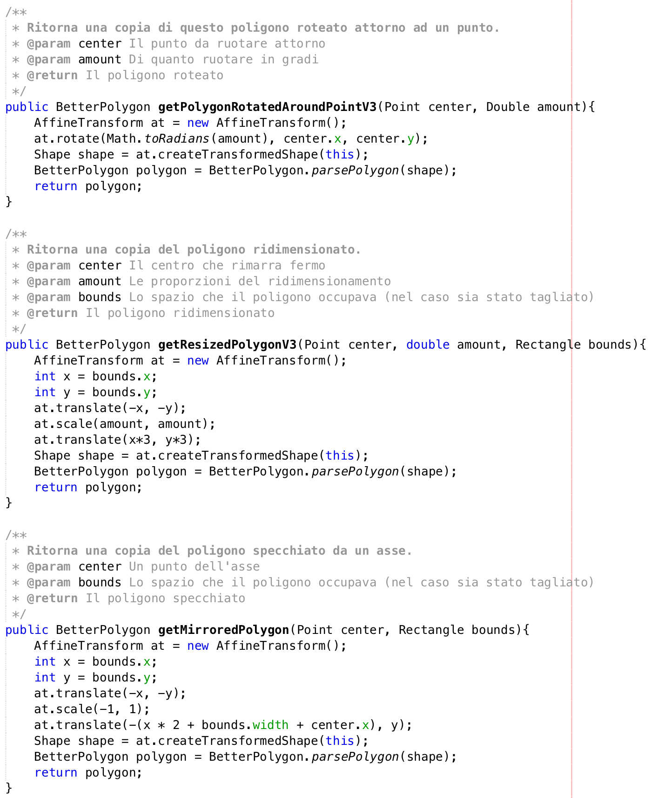

1. [Introduzione](#introduzione)

   - [Informazioni sul progetto](#informazioni-sul-progetto)

   - [Abstract](#abstract)

   - [Scopo](#scopo)

2. [Analisi](#analisi)

   - [Analisi e specifica dei requisiti](#analisi-e-specifica-dei-requisiti)

   - [Use case](#use-case)

   - [Pianificazione](#pianificazione)

   - [Analisi dei mezzi](#analisi-dei-mezzi)

     - [Hardware](#hardware)

     - [Software](#software)

3. [Progettazione](#progettazione)

   - [Design delle interfacce](#design-delle-interfacce)

   - [Design procedurale](#design-procedurale)

4. [Implementazione](#implementazione)

5. [Test](#test)

   - [Protocollo di test](#protocollo-di-test)

   - [Risultati test](#risultati-test)

6. [Consuntivo](#consuntivo)

7. [Conclusioni](#conclusioni)

   - [Sviluppi futuri](#sviluppi-futuri)

   - [Considerazioni personali](#considerazioni-personali)

8. [Sitografia](#sitografia)

9. [Allegati](#allegati)

## Introduzione

### Informazioni sul progetto

  Scuola e classe: SAMT I3AC

  Modulo: 306

  Alievo: Jonathan Mueller

  Docenti: Luca Muggiasca e Geo Peduzzi

  Durata progetto: 6.9.2019 - 20.12.2019

### Abstract

  E’ una breve e accurata rappresentazione dei contenuti di un documento,
  senza notazioni critiche o valutazioni. Lo scopo di un abstract efficace
  dovrebbe essere quello di far conoscere all’utente il contenuto di base
  di un documento e metterlo nella condizione di decidere se risponde ai
  suoi interessi e se è opportuno il ricorso al documento originale.

  Può contenere alcuni o tutti gli elementi seguenti:

  -   **Background/Situazione iniziale**

  -   **Descrizione del problema e motivazione**: Che problema ho cercato
      di risolvere? Questa sezione dovrebbe includere l'importanza del
      vostro lavoro, la difficoltà dell'area e l'effetto che potrebbe
      avere se portato a termine con successo.

  -   **Approccio/Metodi**: Come ho ottenuto dei progressi? Come ho
      risolto il problema (tecniche…)? Quale è stata l’entità del mio
      lavoro? Che fattori importanti controllo, ignoro o misuro?

  -   **Risultati**: Quale è la risposta? Quali sono i risultati? Quanto è
      più veloce, più sicuro, più economico o in qualche altro aspetto
      migliore di altri prodotti/soluzioni?

  Esempio di abstract:

  > *As the size and complexity of today’s most modern computer chips
  > increase, new techniques must be developed to effectively design and
  > create Very Large Scale Integration chips quickly. For this project, a
  > new type of hardware compiler is created. This hardware compiler will
  > read a C++ program, and physically design a suitable microprocessor
  > intended for running that specific program. With this new and powerful
  > compiler, it is possible to design anything from a small adder, to a
  > microprocessor with millions of transistors. Designing new computer
  > chips, such as the Pentium 4, can require dozens of engineers and
  > months of time. With the help of this compiler, a single person could
  > design such a large-scale microprocessor in just weeks.*

### Scopo

  Lo scopo dei questo progetto è di imparare a gestire progetti a partire da una consegna di un cliente seguendo i modelli imparati in classe (cascata), a documentaro  e a fare i diari settimanali.
  Durante la creazione del progetto ci saranno utili molte nozioni imarate da moduli degli anni passati, come 431, 307, 226 e il corrente 306. Questo progetto ci aiuterà anche ad allenarci per fare progetti futuri come il progetto finale in quarta e quelli che svolgeremo sul posto di lavoro.

## Analisi

### Analisi del dominio

Prima dell'invenzione di questo programma per generare un fiocco di neve si doveva disegnare a mano o ritagliare un foglio di carta. Questo prodotto è originale, e non esietevano prodotti simili prima. Non occorrono competenze per far funzionare il programma i quanto il metodo di utilizzo è descritto sulla pagina web del prodotto.

### Analisi e specifica dei requisiti

- L’applicativo può essere sia Java che in Javascript.
  - Se l'applicazione è Java, va creato un sito web con la descrizione e il download dell’applicazione, con descrizione di tutti i requisiti per il funzionamento.
  - Se l'applicazione è in Javascript va creato un sito web per il suo hosting.
- I punti di “taglio” vengono inseriti cliccando col mouse.
- I punti si devono poter aggiungere e resettare completamente.
  - Bonus: rimozione, spostamento di punti
- Il “fiocco di neve” viene generato quando l'utente clicca il tasto “Genera”
  - Bonus: la generazione avviene in tempo reale con una animazione
- Si può salvare il fiocco di neve come immagine raster in formato PNG e vettoriale in formato SVG (l'utente decide le dimensioni).
- L’applicativo deve permettere di salvare i punti di taglio per poter permettere modifiche
  - rigenerazione future.
- In base al tempo a disposizione, nuovi requisiti possono essere inseriti nel progetto
dopo discussione fra formatore e allievo.

  |**ID**            |Req-1                                                                          |
  |------------------|-------------------------------------------------------------------------------|
  |**Nome**          |L'applicativo deve essere in Java o in Javascript            |
  |**Priorità**      |1                                                                              |
  |**Versione**      |1.0                                                                            |
  |**Note**          |Nel sito web evitare colori fastidiosi e utilizzare colori comprensibili a i daltonici |
  |                  |**Sotto requisiti**                                                            |
  |001               |Se l'applicativo è in Java necessita un sito web con descrizione con screenshots, download del file JAR, versione JRE e lista con requisiti di sistema |
  |002               |Se l'applicativo è in Javascript, necessita un sito web per il suo hosting con browser supportati (Explorer 11, Firefox 6, Chrome 76) e la dimensione minima |

  |**ID**            |Req-2                                                                          |
  |------------------|-------------------------------------------------------------------------------|
  |**Nome**          |Deve esserci un'interfaccia grafica                          |
  |**Priorità**      |1                                                                              |
  |**Versione**      |1.0                                                                            |
  |**Note**          |Può essere ridimensionata (min 1024x768)                                       |

  |**ID**            |Req-3                                                                          |
  |------------------|-------------------------------------------------------------------------------|
  |**Nome**          |L'area di lavoro deve essere un triangolo                    |
  |**Priorità**      |1                                                                              |
  |**Versione**      |1.0                                                                            |
  |**Note**          |Il triangolo è sempre il 50% della finestra e centrato                         |

  |**ID**            |Req-4                                                                          |
  |------------------|-------------------------------------------------------------------------------|
  |**Nome**          |I punti di taglio si posizionano con il click del mouse      |
  |**Priorità**      |1                                                                              |
  |**Versione**      |1.0                                                                            |
  |**Note**          |Per commutare tra posizionamento e altre funzione si possono usare pulsanti    |

  |**ID**            |Req-5                                                                          |
  |------------------|-------------------------------------------------------------------------------|
  |**Nome**          |I punti di taglio si possono aggiungere                      |
  |**Priorità**      |1                                                                              |
  |**Versione**      |1.0                                                                            |
  |**Note**          |                                                                               |

  |**ID**            |Req-6                                                                          |
  |------------------|-------------------------------------------------------------------------------|
  |**Nome**          |I punti di taglio si possono resettare                       |
  |**Priorità**      |1                                                                              |
  |**Versione**      |1.0                                                                            |
  |**Note**          |                                                                               |

  |**ID**            |Req-7                                                                          |
  |------------------|-------------------------------------------------------------------------------|
  |**Nome**          |I punti di taglio si possono eliminare                       |
  |**Priorità**      |2                                                                              |
  |**Versione**      |1.0                                                                            |
  |**Note**          |                                                                               |

  |**ID**            |Req-8                                                                          |
  |------------------|-------------------------------------------------------------------------------|
  |**Nome**          |I punti di taglio si possono spostare                        |
  |**Priorità**      |2                                                                              |
  |**Versione**      |1.0                                                                            |
  |**Note**          |                                                                               |

  |**ID**            |Req-9                                                                          |
  |------------------|-------------------------------------------------------------------------------|
  |**Nome**          |Deve esserci un tasto "Genera"                               |
  |**Priorità**      |1                                                                              |
  |**Versione**      |1.0                                                                            |
  |**Note**          |                                                                               |

  |**ID**            |Req-10                                                                         |
  |------------------|-------------------------------------------------------------------------------|
  |**Nome**          |Il fiocco di neve viene generato al click del pulsante "Genera"|
  |**Priorità**      |1                                                                              |
  |**Versione**      |1.0                                                                            |
  |**Note**          |                                                                               |

  |**ID**            |Req-11                                                                         |
  |------------------|-------------------------------------------------------------------------------|
  |**Nome**          |Il fiocco di neve viene generato in tempo reale              |
  |**Priorità**      |2                                                                              |
  |**Versione**      |1.0                                                                            |
  |**Note**          |Ogni volta che aggiungo un punto mostra già il risultato finale                |
  |                  |**Sotto requisiti**                                                            |
  |001               |Si può avere un bottone per attivare-disattivare il rendering live             |

  |**ID**            |Req-12                                                                         |
  |------------------|-------------------------------------------------------------------------------|
  |**Nome**          |Si può salvare il fiocco                                     |
  |**Priorità**      |1                                                                              |
  |**Versione**      |1.0                                                                            |
  |**Note**          |                                                                               |

  |**ID**            |Req-13                                                                         |
  |------------------|-------------------------------------------------------------------------------|
  |**Nome**          |Il salvataggio può essere fatto come immagine PNG o SVG a scelta|
  |**Priorità**      |1                                                                              |
  |**Versione**      |1.0                                                                            |
  |**Note**          |                                                                               |

  |**ID**            |Req-14                                                                         |
  |------------------|-------------------------------------------------------------------------------|
  |**Nome**          |Il salvataggio deve avere dimenzioni scelte dall'utente (500px o 1000px)|
  |**Priorità**      |1                                                                              |
  |**Versione**      |1.0                                                                            |
  |**Note**          |                                                                               |

  |**ID**            |Req-15                                                                         |
  |------------------|-------------------------------------------------------------------------------|
  |**Nome**          |Si possono salvare i punti di taglio per modifiche future    |
  |**Priorità**      |2                                                                              |
  |**Versione**      |1.0                                                                            |
  |**Note**          |Si possono usare file o database a scelta                                      |

  |**ID**            |Req-16                                                                         |
  |------------------|-------------------------------------------------------------------------------|
  |**Nome**          |Si possono caricare i punti di taglio salvati in precedenza  |
  |**Priorità**      |2                                                                              |
  |**Versione**      |1.0                                                                            |
  |**Note**          |                                                                               |
  |                  |**Sotto requisiti**                                                            |
  |001               |Se si usano file con un file explorer o una pagina che mostra direttamente tutti i file |
  |002               |Se si usa un database una pagina che mostra direttamente tutti i file          |

### Use case

È presente solo un'attore che interagisce direttamente con l'applicazione.

### Pianificazione

### Analisi dei mezzi

#### Hardware ####

PC messo a disposizione dalla scuola con Windows

Portatile MacBook Pro personale

#### Software ####

Java (JDK 11.1)

GitHub

## Progettazione

### Design delle interfacce

### Design procedurale

## Implementazione

### Metodi complicati

Questi sono stati i metodi più complicati e che mi hanno dato più problemi:

#### Conversione da Area a BetterPolygon

Arrivato al punto della sottrazione dei poligoni al triangolo mi sono ritrovato con un area quando mi serviva un poligono per fare tutte le operazioni successive. Per convertire ho usato il PathIterator, che passa per tutti i punti dell'area. Questi punti possono avere diversi tipi:
0 Inizio di un poligono
1 Punto di mezzo
4 Fine del poligono
Sapendo questo ho aggiunto i punti ad una array in modo da avere tutti i poligoni salvati come uno solo. Alla fine ho creato un poligono con questi punti.

#### Ridimenzionamento, specchiamento e rotazione dei poligoni

Inizialmente avevo fatto queste tre operazioni a mano, modificando i poligoni punto per punto, ma questa operazione era molto pesante e causava lag quando c'erano molti punti.
Quindi ho cercato un altro modo e ho trovato AffineTransform.
Questa classe permette di fare molte operazioni su shapes tra cui quelle elencate sopra, con una assenza quasi totale di lag.
Il problema è che questa classe è estremamente complicata da usare e ci ho messo un po' a capire come usarla.

## Test

### Protocollo di test

Definire in modo accurato tutti i test che devono essere realizzati per
garantire l’adempimento delle richieste formulate nei requisiti. I test
fungono da garanzia di qualità del prodotto. Ogni test deve essere
ripetibile alle stesse condizioni.

|Test Case       | TC-001                               |
|----------------|--------------------------------------|
|**Nome**        |I punti di taglio si posizionano con il click del mouse |
|**Riferimento** |REQ-04                               |
|**Descrizione** |I punti di taglio si posizionano con il click sinistro del mouse sull'area di lavoro |
|**Prerequisiti**|Applicazione gia avviata sull'editor  |
|**Procedura**   | - Cliccare nell'area di lavoro con il tasto destro |
|**Risultati attesi** | Viene generato un punto sull'area di lavoro |

|Test Case       | TC-002                               |
|----------------|--------------------------------------|
|**Nome**        |Mettere almeno 3 punti e cliccare il punto verde crea un poligono |
|**Riferimento** |REQ-04                               |
|**Descrizione** |Quando ho posizionato almeno 3 punti e clicco sul punto verde si crea un poligono |
|**Prerequisiti**|Applicazione gia avviata sull'editor  |
|**Procedura**   | - Cliccare nell'area di lavoro con il tasto destro per posizionare più punti - Una volta posizionati almeno 3 punti cliccare il punto verde |
|**Risultati attesi** | Viene generato un poligono sull'area di lavoro |

|Test Case       | TC-003                               |
|----------------|--------------------------------------|
|**Nome**        |I punti di taglio si posizionano resettare |
|**Riferimento** |REQ-06                               |
|**Descrizione** |I punti di taglio si possono resettare cliccando il tasto "reset" |
|**Prerequisiti**|Applicazione gia avviata sull'editor e punti posizionati  |
|**Procedura**   | - Cliccare il tasto "reset" |
|**Risultati attesi** | Tutti i punti spariscono |

|Test Case       | TC-004                               |
|----------------|--------------------------------------|
|**Nome**        |I punti di taglio si possono eliminare |
|**Riferimento** |REQ-07                               |
|**Descrizione** |I punti di taglio si possono eliminare cliccando con il tasto destro |
|**Prerequisiti**|Applicazione gia avviata sull'editor e punti posizionati  |
|**Procedura**   | - Cliccare con il tasto destro su un punto |
|**Risultati attesi** | Il punto cliccato viene eliminato |

|Test Case       | TC-005                               |
|----------------|--------------------------------------|
|**Nome**        |I punti di taglio si possono spostare |
|**Riferimento** |REQ-08                               |
|**Descrizione** |I punti di taglio si possono spostare trascinandoli con il mouse |
|**Prerequisiti**|Applicazione gia avviata sull'editor e punti posizionati  |
|**Procedura**   | - Trascinare il punto con il mouse |
|**Risultati attesi** | Il punto segue il mouse |

|Test Case       | TC-006                               |
|----------------|--------------------------------------|
|**Nome**        |Il fiocco di neve viene generato al click del pulsante "Genera"  |
|**Riferimento** |REQ-08                               |
|**Descrizione** |Quando clicco il tasto "Genera" il triangolo viene tagliato e il fiocco viene generato |
|**Prerequisiti**|Applicazione gia avviata sull'editor e punti posizionati  |
|**Procedura**   | - Cliccare il tasto genera|
|**Risultati attesi** | Il triangolo tagliato viene moltiplicato 12 volte in modo da formare il fiocco |

|Test Case       | TC-007                               |
|----------------|--------------------------------------|
|**Nome**        |Il fiocco di neve viene generato in tempo reale |
|**Riferimento** |REQ-09                               |
|**Descrizione** |Quando posiziono un nuovo punto la live viene aggiornata. Si può anche disattivare la generazione in tempo reale |
|**Prerequisiti**|Applicazione gia avviata sull'editor  |
|**Procedura**   | - Posiziono dei punti sull'area di lavoro - Clicco la checkbox per disattivare la live |
|**Risultati attesi** | Il fiocco in live viene aggiornato, e scompare se la checkbox viene deselezionata |

|Test Case       | TC-008                               |
|----------------|--------------------------------------|
|**Nome**        |Si può salvare il fiocco come immagine PNG o SVG a scelta con dimenzioni scelte dall'utente (500px o 1000px) |
|**Riferimento** |REQ-12,REQ-13,REQ-14                 |
|**Descrizione** |Cliccando il tasto "Esporta" si può salvare il fiocco come immagine |
|**Prerequisiti**|Applicazione gia avviata sull'editor e poligoni posizionati  |
|**Procedura**   | - Clicco il tasto "Esporta" - Nel file chooser seleziono un file ".png" o ".svg" in cui salvare - Clicco "Save" - Nel menu seleziono i dettagli del salvataggio - Clicco "Salva"|
|**Risultati attesi** | Nel file selezionato verrà salvata l'immagine. Se il file non esiste viene creato |

|Test Case       | TC-009                               |
|----------------|--------------------------------------|
|**Nome**        |Si possono salvare i punti di taglio per modifiche future |
|**Riferimento** |REQ-15                               |
|**Descrizione** |Cliccando il tasto "Salva" si possono salvare i punti in un file  |
|**Prerequisiti**|Applicazione gia avviata sull'editor e punti posizionati  |
|**Procedura**   | - Clicco il tasto "Salva" - Nel file chooser seleziono un file ".points" in cui salvare - Clicco "Save"|
|**Risultati attesi** | Nel file selezionato verranno salvati i punti. Se il file non esiste viene creato |

|Test Case       | TC-010                               |
|----------------|--------------------------------------|
|**Nome**        |Si possono caricare i punti di taglio salvati in precedenza |
|**Riferimento** |REQ-16                               |
|**Descrizione** |Cliccando il tasto "Carica" si possono caricare i punti da un file  |
|**Prerequisiti**|Applicazione gia avviata sull'editor e file di punti già creato |
|**Procedura**   | - Clicco il tasto "Carica" - Nel file chooser seleziono un file ".points" da cui caricare - Clicco "Open"|
|**Risultati attesi** | I punti e i poligoni vengono creati sul piano di lavoro |

### Risultati test

|Test Case       | Risultato                       |
|----------------|---------------------------------|
|TC-001          | Il punto viene posizionato      |
|TC-002          | Il poligono viene generato      |
|TC-003          | Tutti i punti vengono cancellati|
|TC-004          | Il punto viene eliminato. Certe volte questo non funziona, e la hitbox dei punti è sbagliata. Se questo succede si può chiudere l'editor e aprirne uno nuovo, ma non sempre questo risolve il problema |
|TC-005          | Il punto segue il mouse. Come nel TC-004 succede lo stesso problema, e lo si può provare a risolvere nello stesso modo |
|TC-006          | Il fiocco di neve viene generato|
|TC-007          | Il fiocco di neve viene generato in tempo reale. Se si disattiva la preview scompare |
|TC-008          | Le immagini vengono salvate, e nel caso il file non esiste viene creato |
|TC-009          | I punti vengono salvati solo se seleziono un file ".points",  e nel caso il file non esiste viene creato |

## Consuntivo

## Conclusioni

L'utente potrà finalmente creare un fiocco di neve e non dovrà più farlo a mano.

### Sviluppi futuri
  Il programma è completo e, almeno che il cliente non chiede di aggiungere qualcosa di nuovo, non ci saranno sviluppi futuri.

### Considerazioni personali
  Da questo progetto ho migliorato la mia capacità di programmatore e ho imparato ad usare nuove class come AffineTransform.

## Bibliografia

### Sitografia

-   https://github.com, *github*, 20-12-2019.

-   https://stackoverflow.com, *stackoverflow*, 20-12-2019.

-   https://docs.oracle.com/javase/7/docs/api/, *javadoc*, 20-12-2019

## Allegati

Elenco degli allegati, esempio:

-   Diari di lavoro

-   Codici sorgente/documentazione macchine virtuali

-   Istruzioni di installazione del prodotto (con credenziali
    di accesso) e/o di eventuali prodotti terzi

-   Prodotto
